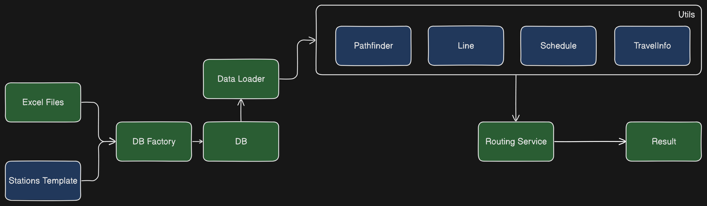

<h1 align="center">
  Metrogo - A little more than a router
</h1>


Metrogo is the route of the subway. The Metroggo finds the fastest route and informs you of the next train to the source station and tells you the cost of your trip.

## Key Features 🗝️

- **Auto-correction** of input station names 
- Fast routing with **minimal time wastage** 
- **The arrival time of the train at the origin station** 
- **Travel cost** 
- The length of time the user is inside the subway 
- Show **when the user arrives at the destination station** 
- A simple and straightforward guide **for the general public** 

## How does the Metrogo work 🤔



MetroGo uses Excel files from Tehran Metro Company and Ali Project to build its database. First, the DB Factory program is run and combines the time data in the Excel files into the stations template file and stores it in the database.

Then the Data Loader program reads the database and creates line and station objects. Then the Routing service uses the pathfinder , line , schedule , travelinfo and wordutils tools to perform routing and add information including train schedules and other items to the result and then outputs the result.

## Quick start ⏩

Clone the project to your system with the following command :

```bash
git clone https://github.com/theothermmd/Metrogo
```

Enter the project directory with the following command: 

```bash
cd Metrogo
```

Install Metrogo prerequisites with the following command:

```bash
pip install -r requirements.txt
```

Run the Metrogo API server with the following command:

```bash
fastapi dev .\metrogo\api\server.py
```

The MetroGo server is listening to you on [127.0.0.1:8000](http://127.0.0.1:8000 ) :)

> [!TIP]
> You can use [httpie](https://httpie.io/) or [postman](https://www.postman.com/downloads/) to request the Metrogo API, depending on your convenience. **httpie is recommended.**
## Participation in development

Are you interested in Metrogo? Read this document and **we welcome you :)**

## Special thanks

Very special thanks. to [@Mostafa-Kheibary](https://github.com/mostafa-kheibary) for the [tehran-metro-data](https://github.com/mostafa-kheibary/tehran-metro-data) project
Also special thanks to Tehran [Metro Company](https://metro.tehran.ir/)
## Frequently asked questions

> [!CAUTION]
> ##### Can I use this project in commercial projects?
> Yes. You can. But you should know that it is true that the metro train schedule is from the official source of the metro company, but according to the experience and feedback of others, trains do not always arrive at the station on time due to technical problems or passengers preventing the train from moving.

##### How can I add MetroGo to my project?

Metrogo is not only a regular program, but also a Python package. Move the metrogo folder into your project and use Metrogo like any other Python package.


